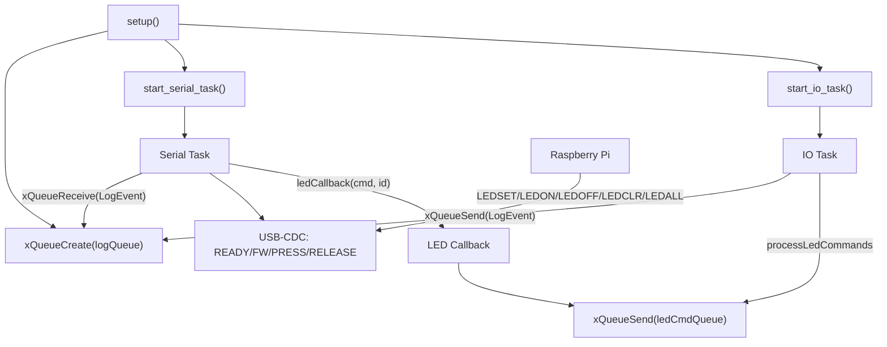
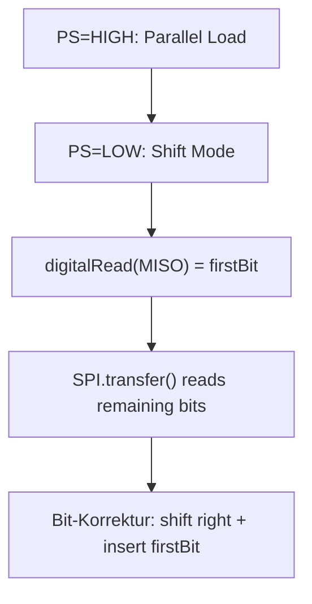

# Firmware-Code-Guide (ESP32-S3, Arduino + FreeRTOS) – konkret am *Selection Panel* Code

## 1) Embedded vs. Desktop – Was macht Firmware anders?

**Regel:** Firmware ist *zeit- und zustandskritisch* und läuft nah an Hardware – Debugging und Ressourcen sind begrenzt.

**Beispiel (aus deinem Code):**

- **Zeitbasis ist Teil der Logik:** IO-Task läuft alle 5 ms (`IO_PERIOD_MS = 5`) → 200 Hz Sampling.
- **Hardware-Protokolle sind „echt":** CD4021 braucht definierte Load-/Shift-Sequenz mit `delayMicroseconds(...)`, sonst verlierst du Bits.
- **Nebenläufigkeit ist explizit:** Zwei Tasks (`IO`, `Serial`) plus Queues statt „ein Thread pro Problem".

**Anwendung (Faustregeln):**

- Desktop: „Durchsatz" zählt oft mehr als „Latenz".
- Firmware: **Worst-Case-Latenz** und **Determinismus** zählen; CPU-Spikes oder Heap-Fragmente werden zu echten Bugs.

## 2) Arduino C++ – C++11 auf GCC 8.4: was geht, was nicht?

**Regel:** Du kannst viel modernes C++ nutzen – aber ohne „Desktop-Komfort" (Exceptions/RTTI/Heap-heavy STL).

**Geht gut (und nutzt du bereits):**

- `constexpr`, `static_assert` (z. B. `PWM_DUTY_PERCENT <= 100`)
- `static inline` Header-Funktionen (z. B. `bitops.h`)
- RAII ist möglich (z. B. `SpiGuard`, falls er `beginTransaction/lock` kapselt)

**Vorsicht / meist deaktiviert oder teuer:**

- **Exceptions** (`throw/catch`) sind in Arduino/ESP32 häufig aus oder unerwünscht (Codegröße/Runtime).
- **RTTI** (`dynamic_cast`, `typeid`) oft aus oder teuer.
- `std::vector`, `std::string`, iostreams: funktionieren zwar teils, sind aber **Heap-lastig**.

**Anwendung:**

- Für Datenstrukturen: lieber **fixed-size Arrays** + Indizes (wie bei dir: `uint8_t ledState_[LED_BYTES];`).
- Für „Komfort": kleine Utility-Header (`bitops.h`) statt STL.

## 3) Embedded-Dogma – Kein dynamischer Speicher, keine Blockierung (mit Nuance)

**Regel:** In der *Hot-Path* (periodischer Task/ISR) gilt: **kein `new/malloc`, keine unbounded waits**.

**Beispiel (gut gelöst):**

- Alle Buffers sind statisch: `btnRaw_`, `btnDebounced_`, `ledState_` etc.
- Queues werden einmalig in `setup()`/`start_io_task()` erstellt (`xQueueCreate`).

**Nuance (wo Blockierung ok ist):**

- `vTaskDelayUntil(...)` ist *geplantes Warten* → gut und deterministisch.
- Mutex-Lock mit `portMAX_DELAY` ist formal „blockierend". In deinem Design ist das ok, **wenn**:
  1. SPI-Kritische Sektion kurz bleibt
  2. kein Deadlock-Pfad existiert
  3. nur wenige SPI-User (aktuell im Wesentlichen IO-Task)

**Anwendung (Best Practice):**

- Queue-Sends im IO-Task: so wie bei dir **non-blocking** (`timeout 0`) ist korrekt.
- Wenn du später mehrere SPI-Nutzer hast: überlege `lock(timeout)` statt „unendlich".

## 4) Code-Struktur – von Includes bis `loop()`

**Regel:** `setup()` initialisiert Ressourcen, `loop()` ist „leer", wenn FreeRTOS die Anwendung trägt.

**Beispiel (dein `main.cpp`):**

- `setup()`:
  - USB-CDC Stabilisierung `delay(1500)`
  - `logQueue_ = xQueueCreate(...)`
  - Startreihenfolge: `start_serial_task()` vor `start_io_task()` (damit `READY` früh kommt)
- `loop()`:
  - `vTaskDelay(portMAX_DELAY)` → spart CPU, Tasks arbeiten

**Anwendung:**

- Halte `Serial.*` in genau **einem** Task (bei dir: `serial_task.cpp`) → verhindert Timing-/Lock-Probleme.

## 5) Syntax im Detail

### 5.1 Datentypen – warum `uint8_t` statt `int`

**Regel:** Firmware-Typen sind *präzise* und *plattformstabil*. `int` ist je nach Architektur anders.

**Beispiel:**

- IDs/Bitfelder: `uint8_t` (0…255) passt exakt zu Bytes/Schieberegistern.
- Timestamps: `uint32_t now = millis();` (Millis-Overflow ist definiert und wird differenziert genutzt)

**Anwendung:**

- Für IO-Bitmaps: `uint8_t[BTN_BYTES]` ist optimal (keine Alignment/Overhead-Fragen).

### 5.2 `static`, `const`, `constexpr`

**Regel:**

- `constexpr`: compile-time Konstante (Pins, Größen, Perioden)
- `const`: runtime konstant (z. B. nach Init)
- `static`: Lebensdauer „für immer", Sichtbarkeit file-local (wenn in `.cpp`)

**Beispiele:**

- `constexpr uint32_t IO_PERIOD_MS = 5;` (compile-time)
- `static uint8_t btnRaw_[BTN_BYTES];` (statischer Puffer im Modul)
- `static QueueHandle_t logQueue_ = nullptr;` (modulinterner Handle)

**Anwendung:**

- Pins/Counts immer `constexpr`, Zustände immer `static` in `.cpp` (nicht global exportieren).

### 5.3 `inline`

**Regel:** Kleine, häufig genutzte Bit-Helfer als `static inline` in Headern (keine Call-Overhead, keine Mehrfachdefinition).

**Beispiel:** `bitops.h` kapselt Bitreihenfolge + Active-Low sauber.

### 5.4 Zeiger, Referenzen, Arrays

**Regel:** In Firmware sind Arrays + Zeiger Standard, Referenzen für „muss existieren" gut.

**Beispiele:**

- `void Cd4021::readRaw(SpiBus& bus, uint8_t* out)`
  - `bus` als Referenz (muss gültig sein)
  - `out` als Zeiger auf Buffer (schreibt Bytes raus)
- `const uint8_t* debNow` in Selection/Debounce (read-only)

**Anwendung:**

- Für „Kontrakte": `const` konsequent, und Buffergrößen über `*_BYTES`.

### 5.5 Bit-Operationen (essentiell)

**Regel:** Schieberegister = Bitlogik. Korrekte Masks/Shift-Richtung entscheiden über „Button 1 geht nie".

**Beispiele aus deinem Design:**

- **CD4021 MSB-first:** `btn_bit(id) = 7 - ((id-1)%8)`
- **74HC595 LSB-first:** `led_bit(id) = (id-1)%8`
- **Active-Low:** gedrückt = 0 → `activeLow_pressed(...)` invertiert korrekt

**Anwendung:**

- Halte Hardware-Bitordnung **zentral** (wie `bitops.h`). Niemals „mal eben" im Task umrechnen.

## 6) Arduino-Funktionen – pinMode, SPI, PWM (konkret)

### GPIO

- `pinMode(PIN_BTN_PS, OUTPUT)` / `digitalWrite(...)`: CD4021 Parallel-Load/Shift steuern
- `digitalRead(PIN_BTN_MISO)`: **kritisch** für das *erste* Bit (Taster 1), bevor SPI clockt

### SPI

- `SPI.begin(sck, miso, mosi, -1)` in `SpiBus::begin(...)` (flexible Pins am ESP32)
- `SPI.transfer(...)`:
  - CD4021: Dummy-Transfers zum Einlesen
  - 74HC595: Bytes rausschieben (Daisy-Chain: letztes Byte zuerst)

### PWM (LEDC auf ESP32)

- `ledcSetup(...)`, `ledcAttachPin(...)`, `ledcWrite(...)`
- Wichtig: OE ist **active-low** → Duty muss invertiert werden (machst du korrekt).

## 7) Ablauf- und Datenfluss-Diagramme (für deinen Code)

### 7.1 Ablauf (Tasks + Queues)

### 7.2 Datenfluss (Buttons → Debounce → Selection → LEDs)

### 7.3 Sonderpfad: CD4021 „erstes Bit"

## 8) FreeRTOS-Architektur (wie dein System „tickt")

**Regel:** Ein *periodischer IO-Task* macht Hardware-Sampling + State-Update; ein *Serial-Task* entkoppelt Kommunikation.

**Bausteine in deinem Design:**

- **IO Task (prio `PRIO_IO`)**
  - `vTaskDelayUntil(..., IO_PERIOD_MS)` → stabiler Takt
  - liest Buttons, entprellt, selektiert, schreibt LEDs
  - verarbeitet LED-Commands vom Pi (`ledCmdQueue_`)
- **Serial Task (prio `PRIO_SERIAL`)**
  - Initialisiert `Serial.begin(...)`
  - sendet `READY` / `FW ...`
  - liest Kommandos vom Pi (`LEDSET 003`, …)
  - konsumiert `LogEvent` aus `logQueue_` und sendet `PRESS/RELEASE`

**Wichtige Detailprüfung:**

In FreeRTOS gilt: **größere Zahl = höhere Priorität**. Dein Config-Kommentar („Serial hoch…") passt nicht zu `PRIO_IO = 5`, `PRIO_SERIAL = 2`. Technisch ist das nicht automatisch falsch (IO darf durchaus höher sein), aber Kommentar/Absicht sollten konsistent sein.

**Anwendung (wenn du skalierst):**

- Bei 100 Tastern/LEDs: IO-Task bleibt gleich (Bitmaps wachsen), Serial-Task bleibt gleich (Protokollzeilen).
- Wenn du später WiFi nutzt: Core-Pinning beibehalten (Core 0 oft für WiFi/BLE), Anwendung auf Core 1.

## Glossar (alphabetisch)

- **Active-Low** – Logikpegel, bei dem `0` „aktiv" bedeutet (z. B. Taster gedrückt).
- **Arduino Core** – Board-Support-Paket (HAL + Libraries), das `pinMode`, `SPI`, `Serial` etc. bereitstellt.
- **Bitmaske (Mask)** – Bitmuster zum Setzen/Löschen/Isolieren von Bits (z. B. `state &= ~mask`).
- **Busy-Wait** – Aktives Warten ohne Schlafen (in Firmware meist vermeiden; `vTaskDelayUntil` ist besser).
- **Daisy-Chain** – Kaskadierung mehrerer Shiftregister; Bytes müssen oft „hinten anfangen" (letztes IC zuerst).
- **Debounce (Entprellen)** – Filter, der nur stabile Tasterzustände übernimmt (bei dir zeitbasiert über `DEBOUNCE_MS`).
- **Determinismus** – Vorhersagbares Timing (gleiche Eingaben → gleiche zeitliche Reaktion).
- **FreeRTOS Task** – Leichtgewichtiger Thread im RTOS mit eigener Priorität und Stack.
- **ISR** – Interrupt Service Routine (hier nicht genutzt; du pollst periodisch).
- **LEDC** – ESP32 PWM-Hardware (Timer/Channels) für flimmerfreie Helligkeitssteuerung.
- **Mutex** – Sperre für exklusiven Zugriff (bei dir für den SPI-Bus).
- **Non-blocking** – Operationen, die nicht unbegrenzt warten (z. B. Queue-Send mit Timeout 0).
- **One-Hot** – Zustand, bei dem genau eine LED „an" ist (bei dir via `buildOneHotLED(activeId_)`).
- **Polling** – Regelmäßiges Abfragen eines Zustands (bei dir: alle 5 ms).
- **Queue (FreeRTOS)** – Thread-sicherer FIFO-Puffer zur Entkopplung von Tasks (LogEvents, LED-Commands).
- **SPI Mode** – Clock-Polarität/-Phase (MODE0/1/2/3); muss zur Hardware passen (CD4021 vs. 74HC595).
- **Tick** – RTOS-Zeiteinheit; `vTaskDelayUntil` arbeitet relativ zu Ticks.
- **USB-CDC** – USB serial emulation (COM-Port), kann beim Start „Zeit zum Stabilisieren" benötigen.
